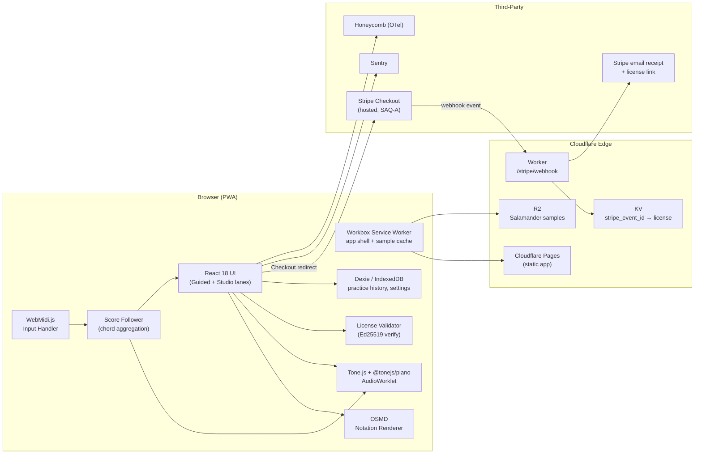

# Architecture — Piano-Practice

> **Derived from:** [MASTER-PLAN.md](MASTER-PLAN.md) §3, §4, §5, §6.
> **Status:** Authoritative summary. If this document and the Master Plan diverge, Master Plan wins and this file is stale.
> **Scope:** Phase 1 MVP (Bach Inventions, $29 lifetime). Phase 2/3 deltas called out inline.

---

## 1. System Overview

Piano-Practice is a **statically-hosted PWA** with a narrow, single-purpose Cloudflare Worker for payments. The browser is the runtime; Cloudflare is the edge; there is no origin server in Phase 1.

Key properties:
- **Offline-first.** Service Worker + IndexedDB + sample cache; after first load, the app runs with no network.
- **No user accounts in Phase 1.** Access is gated by an Ed25519-signed license token, emailed to the buyer by the Stripe webhook handler.
- **Device-local state.** Practice history never leaves the user's browser in Phase 1. JSON export/import provides portability and DR.
- **Curated corpus only.** Zero user uploads; zero parsing of untrusted MusicXML/MIDI.

---

## 2. High-Level Component Diagram (Phase 1)



**Phase 2 additions:** Supabase (Postgres + Auth + Realtime, EU region) replaces KV as the source of truth; user accounts replace license-only access; `audit.events` backed up weekly to AWS S3 with Object Lock.

**Phase 3 additions:** Yjs CRDT over Supabase Realtime for multi-device sync; DPIA-gated per-user fingering personalization.

---

## 3. Runtime Data Flow

### 3.1 First visit (cold)

1. Browser requests `/` → Cloudflare Pages serves HTML + JS shell.
2. Service Worker installs on first load; precaches app shell + bundled corpus manifest.
3. On piece selection: SW fetches Salamander samples from R2 (progressive — Lite ≤ 5 MB first).
4. AudioContext + AudioWorklet initialise on the first user gesture (browser autoplay policy).
5. If user has a license token (from URL param or localStorage), `LicenseValidator` verifies the Ed25519 signature client-side; no network required. The token's `email_hash` is an opaque blob to the client — it was computed server-side using a salt held only in Workers Secrets.

### 3.2 Practice session

1. User connects MIDI device → `WebMidi.js` surfaces input events.
2. `ScoreFollower` aggregates incoming notes with a 50 ms chord window, matches against the active piece.
3. Matched notes trigger visual feedback (OSMD overlay) and audio (`@tonejs/piano`).
4. Session timings accumulate in memory; on session end, persisted to Dexie (`practice_sessions` table).
5. RUM events (anonymous, opt-in) sent to Honeycomb: `audio.latency.p95`, `notation.render.ms`, `midi.roundtrip.ms`.

### 3.3 Purchase flow

1. User clicks "Buy lifetime" → redirected to Stripe Checkout (hosted).
2. Stripe processes payment, emits `checkout.session.completed` webhook.
3. Cloudflare Worker `/stripe/webhook` verifies HMAC (`stripe.webhooks.constructEvent`), checks idempotency against KV (`stripe_event_id`), issues Ed25519-signed license token with payload `{email_hash, sku, issued_at, version}`.
4. Worker stores `{stripe_event_id → license_token}` in KV; Stripe emails buyer the receipt with license link.
5. User opens link → app reads token from URL → `LicenseValidator` verifies → access granted. Token stored in localStorage for subsequent visits.

See `MASTER-PLAN.md §5.5` for full Stripe integration security.

---

## 4. Trust Boundaries

```
┌──────────────────────────────────────────────────────┐
│  USER BROWSER (client — assume fully compromised)    │
│  ┌──────────────────────────────────────┐            │
│  │  React app, Dexie, SW, WebMidi       │ public CDN │
│  └──────────────────────────────────────┘            │
└──────────────────────────────────────────────────────┘
                   ▲               ▲
                   │HTTPS          │HTTPS
                   ▼               ▼
┌────────────────────────┐   ┌────────────────────────┐
│  CLOUDFLARE PAGES + R2 │   │  STRIPE (hosted)       │
│  (static, public)      │   │  payment card data     │
└────────────────────────┘   └────────────────────────┘
                                       │
                                       │signed webhook (HMAC)
                                       ▼
                        ┌──────────────────────────────┐
                        │  CLOUDFLARE WORKER           │
                        │  (private — webhook + KV)    │
                        │  Ed25519 signing key lives   │
                        │  ONLY here (Workers Secrets) │
                        └──────────────────────────────┘
```

- The Ed25519 **private** signing key exists **only** in Cloudflare Workers Secrets. The **public** verification key is embedded in the app bundle.
- The app never talks to Stripe directly for payment data — only the redirect is from the app; the confirmation round-trip is Stripe → Worker.
- No client ever writes to R2 or KV. R2 is read-only public with signed URLs for samples; KV is written only by the Worker.
- `private` and `audit` Supabase schemas (Phase 2+) are **service-role-only**; the app uses `anon` key and is bound by RLS.

Threat model detail: `docs/security/THREAT-MODEL.md` (workshop Week 4).

---

## 5. Data Stores

| Store | Phase | Purpose | Encryption | Schema |
|---|---|---|---|---|
| App bundle | 1+ | MusicXML, MIDI ref, fingering manifests | N/A (public) | `corpus/metadata.json` — cryptographic hash per piece |
| Cloudflare R2 | 1+ | Salamander samples (signed URLs) | At-rest AES-256 (default) | Path: `samples/salamander-v3/{note}.mp3` |
| Cloudflare KV | 1 | Dual-key: `stripe:<event_id> → license_token` (idempotency), `email:<email_hash> → event_id` (recovery), `revoked:<event_id> → ts` (revocation) | At-rest (default) | Key-value, TTL: none |
| IndexedDB (Dexie) | 1+ | Practice history, settings, sample cache | None v1; AES-GCM v3 | `sessions`, `pieces`, `settings`, `samples` (versioned) |
| Supabase Postgres | 2+ | Users, licenses, sessions, audit | At-rest AES-256 + Vault | `public.users`, `public.licenses`, `public.practice_sessions`, `audit.events` |
| AWS S3 (off-vendor) | 2+ | `audit_log` backup, Object Lock 7 yr | At-rest AES-256 + CMK | Weekly dump |

Dexie versioning strategy: append-only, forward-migration only, never drop without export. See `MASTER-PLAN.md §6.2`.

---

## 6. Sync Model

| Phase | Model | Mechanism |
|---|---|---|
| **1** | Device-local only | Dexie + JSON export/import (GDPR Art. 20 portability) |
| **2** | Server-authoritative for license/billing; client-local for practice with periodic upload | Append-only event log to Supabase |
| **3** | Multi-device sync | Yjs CRDT over Supabase Realtime channels; per-piece `Y.Doc`; LWW for settings |

Rationale: ADR-013, ADR-014. The audit's CRIT-A3 ("sync ambiguity") is closed by phasing rather than upfront CRDT commitment.

---

## 7. Deployment

```
main branch → GitHub Actions CI (blocks on ADR-016 checks)
                 │
                 ├── Cloudflare Pages (preview URL per PR)
                 └── Cloudflare Pages (production on merge)

Cloudflare Workers: deployed via `wrangler publish` from GitHub Actions
  (requires scoped deploy token; account protected by hardware MFA)
```

Rollback: Cloudflare Pages instant rollback (≤30 s); Worker versioning via `wrangler rollback`. DB migrations (Phase 2+) always reversible via Supabase CLI forward+down scripts — never destructive.

---

## 8. Observability Topology

| Signal | Source | Sink | Purpose |
|---|---|---|---|
| Exceptions | Browser | Sentry | Error tracking, release health |
| Traces | Browser (OTel SDK) | Honeycomb | Span around `audio.init`, `notation.render`, `midi.roundtrip`, `sample.load` |
| RUM metrics (anonymous, opt-in) | Browser | Honeycomb via OTel | `audio.latency.p95`, `audio.latency.p99`, `notation.render.ms`, `sample.load.bytes` |
| Uptime | Sentry Cron | Pager (founder SMS) | SLO burn-rate |
| Analytics | Cloudflare Web Analytics | CF dashboard | Traffic (no cookies, privacy-preserving) |

SLOs, error budgets, burn-rate alerts: `MASTER-PLAN.md §4.1` and `docs/operations/SLO.md` (to be authored Week 4).

---

## 9. Performance Budget (enforced in CI)

| Metric | Budget | Enforcement |
|---|---|---|
| Initial JS gz | ≤ 200 kb | Lighthouse CI + `vite-bundle-visualizer` |
| Total JS gz (chunked) | ≤ 1 MB | same |
| Salamander Lite | ≤ 5 MB | bundle audit script |
| LCP p75 (4G mobile) | ≤ 2.5 s | Lighthouse CI |
| INP p75 | ≤ 200 ms | Lighthouse CI |
| CLS | ≤ 0.1 | Lighthouse CI |
| Audio latency p95 (wired MIDI) | ≤ 30 ms | RUM threshold alert |

Full budget table: `MASTER-PLAN.md §4.3`.

---

## 10. What's Out of Scope for Phase 1

Tracked here to resist scope creep. Add an ADR amendment to move any of these in.

- User accounts / auth (ADR-019)
- Multi-device sync (ADR-013)
- User uploads (§5.3 reintroduction gated to Phase 2)
- Subscription billing (Phase 3)
- Children's pathway (ADR-017, never before v3.0)
- US/UK/BR users (ADR-018)
- Non-Bach repertoire (Phase 2 expansion conditional on G2)
- Runtime ML / personalization (Phase 3+, DPIA-gated)
- PDF support (§5.3)
- Teacher tools / B2B (Phase 3)

---

## 11. References

- [MASTER-PLAN.md](MASTER-PLAN.md) — authoritative strategic and technical plan
- [adr/](adr/) — decision records (ADR-001 through ADR-019)
- [SECURITY.md](SECURITY.md) — security posture overview
- `docs/operations/` — SLO, DR, IR-PLAN (authored Week 4)
- `docs/security/` — THREAT-MODEL, CSP, UPLOAD-PIPELINE (authored Weeks 4–12)
